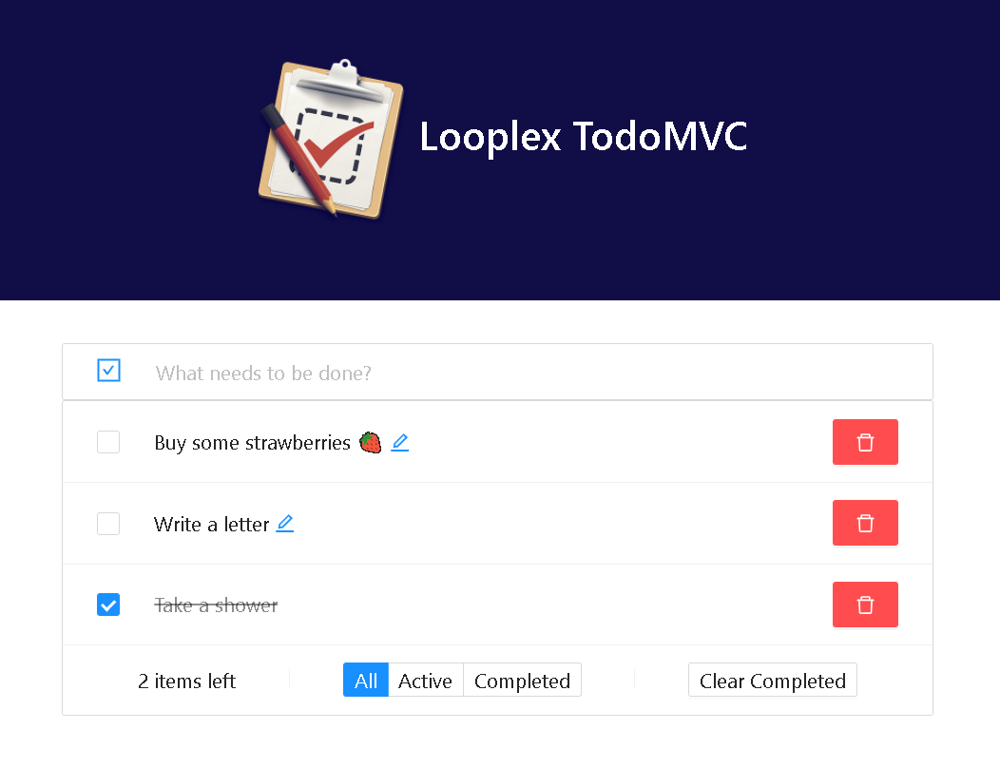

<h1 align="center">
  Looplex TodoMVC
</h1>

<div align="center">
  
</div>

## About

Using mobx-state-tree, ant design and react, create a todo list controlling many functionalities and states.

## 🛠️ Technologies

This project was developed with:

- React
- Mobx-state-tree
- Ant Design

## 🚀 How to run

```bash
# Clone the repository and open the directory

$ git clone https://github.com/shinjiaki-looplex/looplex-todoMVC.git && cd looplex-todomvc

# Install dependencies

$ yarn

# Run project

$ yarn start

```